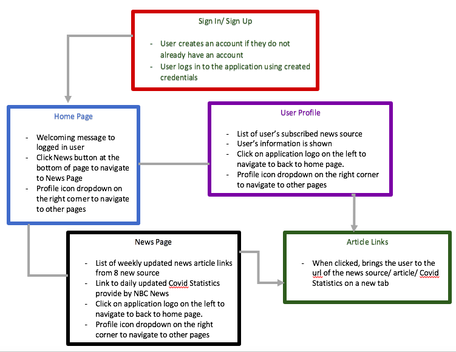

# Terrific Coders - KnowCOVID


## Overview

KnowCOVID is a news application designed to deliver coronavirus news. Our content
is exclusive to written news articles; news from videos and podcasts are avoided.
Articles are updated each week in order to keep content up-to-date. The news
we provide relates more to the coronavirus pandemic in the U.S rather then
the situation in other countries. 


## Getting Started
This README.md is visible because you have access to 'Terrific_Coders_PROJECT'.
Please download the repository. All relevant code is in the folder 
'Terrific_Coders_PROJECT-master'. 

Instructions to run the project:
1. Download the repository from 'Terrific_Coders_PROJECT-master'
2. Open command line
3. To run the frontend server, navigate to the following directory path:

      ``` /Terrific_Coders_PROJECT/Terrific_Coders_PROJECT-master/KnowCOVID/knowcovid ```

4. Install Node.js

      ``` npm install```

5. Run the server and open http://localhost:3000 to view it in the browser.

      ```npm start``` 

6. To stop running the server:

      ```control-C```

7. To run the backend, on commandline navigate to the following directory path:

      ```/Terrific_Coders_PROJECT/Terrific_Coders_PROJECT-master```

8. Run Internet_to_text

      ```python3 Internet_to_text.py```

9. Run Automate_en_masse

      ```python3 Automate_en_masse.py```

10. Look at results.txt in 'Websites-of-the-Week' 

## Requirements

All of our code is written in two languages:
* The frontend is written in React.
* The backend in written in Python.

Make sure you have support for both languages.

The following are commands to run to ensure you have all available
libraries:
* npm install
* npm install react-router-dom
* pip install newsapi-python
* pip install bs4


## Data Model

Keyword lists and preferred websites are initialized in PYT_dictionary.py .
Keyword lists are the following:
* PRIMARY   - a few terms that guarentee an article type (in this case its 'coronavirus', 'COVID-19', and 'corona')
* SECONDARY - a long list of terms that are likely to be found alongside primary keywords.
* BAD       - terms that identify a topic to be avoided in article. In our case, the topic is politics.
* Website lists are the following:
* preferred_websites - limit searches of articles on the internet to trusted sources.

The backend is made up of 4 files: 
1. Internet_to_text.py -
    * Find links for articles from our trusted sources. Save those
                      links to a .txt file.
2. Automate_in_masse.py -
    * Converts the content of an article, from some given link, to
                      .txt files
3. scrape_article.py -
    * Classify articles extracted by scrape_article.py into 
                      different article types. Makes decisions about whether
                      the associated website to that .txt file should be 
                      posted to our website.
4. PYT_dictionary.py - 
    * By using the output given from Internet_to_text.py, runs
                       both scrape_article.py and the functions in PYT_dictionary.py
                       to give a updated list of websites to be used for the week.
                       This official list is found under the folder 
                       'Websites-of-the-Week' under the name 'results.txt'. It is 
                       located in the directory KnowCOVID/knowcovid/src/assets/
                       in order to update the links to the website.
                       
Functions available in PYT_dictionary.py include:
* print_NEAT(...) - prints a list with 5 elements per line
* print_keyword_lists(...) - prints 3 keyword lists with 5 words per line.
* classify_article(test_runs_date, fileNames, list_of_url) - can classify an article to 5 different types:
1. "This is a good article!"
2. "This article is politics and corona."
3. "This article is politics."
4. "This article is irrelevant."
5. "This article is a mix of things."
                           
An article that belongs to our website is a "...good article!". However, if our extracted content is not directly related to coronavirus, it may be appropriate to have a "...mix of things." article for a preferred website. The other 3 article types aren't necessary for the backend but were relevant when trying to find 'formulas' for classification of articles.
                           

## Site map

Here is a site map that shows how pages are related to each other, what content names of pages contains, and where they flow to:



## User Stories or Use Cases

1. As non-registered user, I can create a new account. 
2. As a registered user, I can login using the created account. 
3. As a user, I can access resources featured on KnowCOVID by clicking the new links.
4. As a user, I can view weekly updated news links.
5. As a user, I can view user profile information.
6. As a user, I can add news provider subscribed list. 

## References Used

* https://reactjs.org/docs/testing-recipes.html#data-fetching
* https://stackoverflow.com/questions/55830414/how-to-read-text-file-in-react
* https://www.bitdegree.org/learn/html-tab


## Authors
- Michael Salamon, Xin Chen, Janice Ma, Orion Cadri
